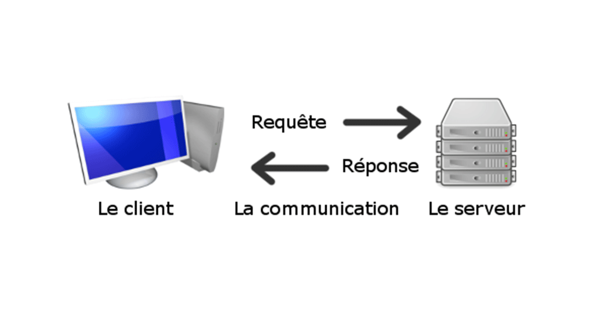

# TP3 - TCP 
Programme réalisé par Aksel Vaillant sous Maven et IntelliJ avec le JDK 1.8

## Configuration de Maven
Si le programme est exécuté à l'ENSIM, il faut inclure le fichier settings.xml dans le dossier .m2 
situé dans le dossier User pour le proxy. Une fois ajouté, il suffit de cliquer sur "clean" et puis 
"install" dans le sous-menu Maven pour installer l'ensemble des dépendances.

La configuration nommée TP permet de lancer à la fois le main de FTPServer, dans un premier temps, et ensuite,
le main de FTPClient.

## Programme
Pour faire fonctionner le programme, il faut préalablement remplir le DEFAULT_DIRECTION_FOLDER 
qui contient les fichiers serveur et client, et ajouter un double backslash à la fin (\\), 
c'est un attribut qui se situe dans les 2 classes : FTPClient et FTPServer. 

Exemple test de l'emplacement des fichiers ressources pour le client :

    private final String DEFAULT_DIRECTION_FOLDER = "....\\TP3 - TCP\\src\\main\\resources\\CLIENT_DIR\\";

Dans le main de FTPServer, il faut ainsi commencer à lancer le serveur. Les diverses commandes s'effectuent 
correctement avec le client.

Egalement, le choix de ne pas vouloir split la commande en plusieurs sous parties est voulu pour
une expérience plus compréhensible.

